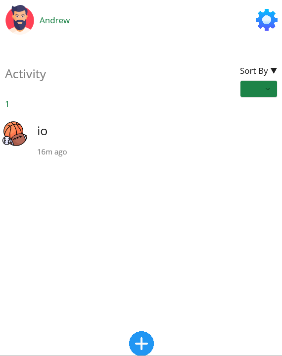
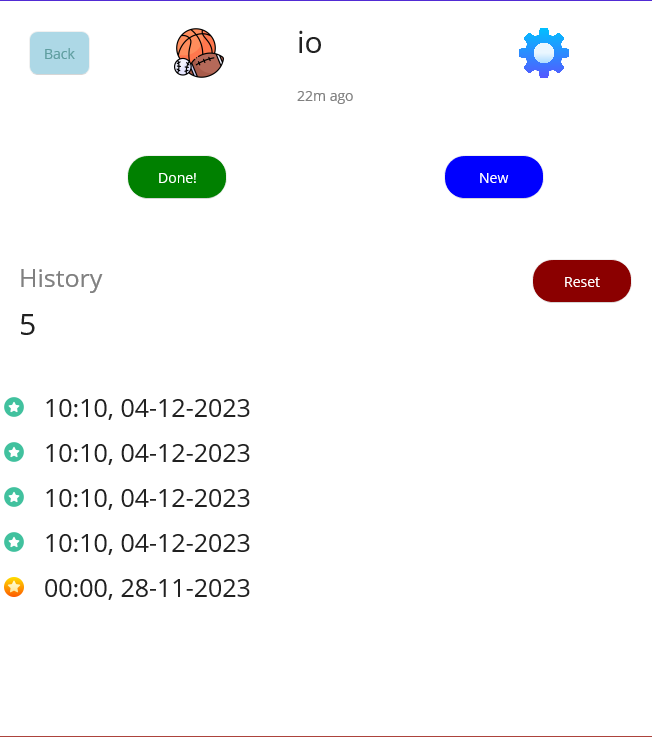
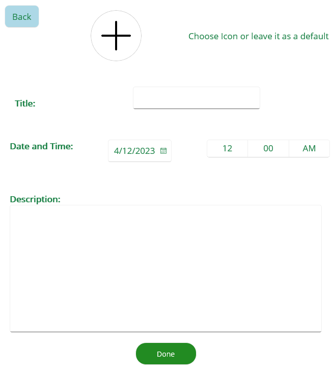
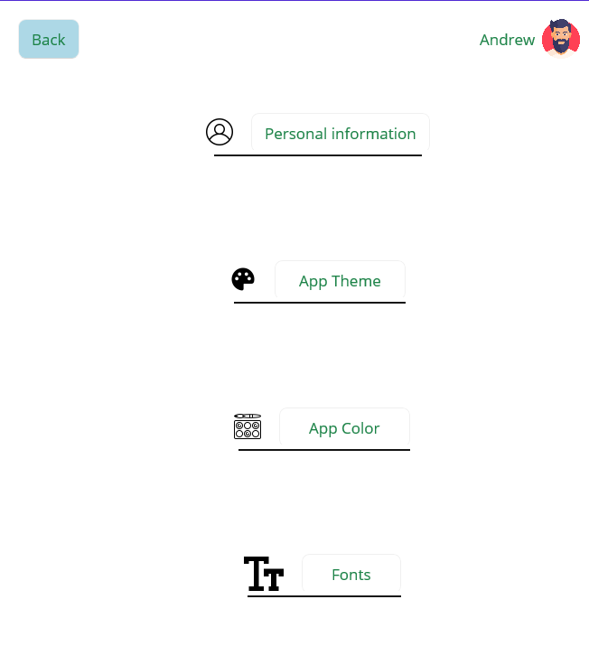

# HowLongSince_MobileApp

## Description

**HowLongSince** is a mobile application designed to track elapsed time after the completion of specific activities. Users, such as athletes, can create and name activities 
like "running." Upon completion, pressing the "Done" button initiates the time counter. HowLongSince is a valuable tool for individuals monitoring the time elapsed since the 
accomplishment of specific tasks.

## Design

### Main Menu Page:

- User Icon and Name
- Settings Button: Change app settings, including colors, theme, font size, and user name.
- Activity Counter: Displays activities.
- Sort By List Drop: Options include "All," "Monthly," and "Daily."
- List with Activities: Displays activities based on the selected sort option.
- Plus Button: Creates a new activity.

### Chosen Activity Page:
- Back Button: Returns to the previous page.
- Settings Button: Provides the ability to manage the chosen activity.
- Done Button: Upon pressing, the user updates the activity history, resets the timer to 0, and automatically aligns the time and date with the user's current system settings.
- New Button: Pressing this button updates the activity history, resets the timer to 0. The user can customize the time, date, and add/edit a description.
- History Counter: Displays the number of recorded histories within the chosen activity.
- History List: Displays the date and time of each history within the chosen activity, along with its validity:
  - 🟢 Green star: Less than a 1-day time difference.
  - 💛 Yellow star: Less than a month difference.
  - ⚫ Black star: More than a month ago.
- Reset Button: Resets the history counter and deletes all histories.

### Creating New Activity Page:

- Back Button: Returns to the previous page.
- Plus Icon: Clicking this icon allows the user to change the icon for the new activity. If the user does not choose, the icon will default to an empty folder icon.
- Title: The user must provide a title for the new activity; otherwise, the activity will not be created.
- Date and Time: The user can change the time and date, but if not, the date and time will be automatically aligned with the user's current system date and time on the mobile.
- Description: The user can describe the case if additional information is needed about the newly created activity.
- Done Button: Pressing this button finalizes the creation of the new activity.

### Settings Page:

- Back Button: Returns to the previous page.
- User Icon and Name.
- Personal Information Button: Allows the user to change their account name.
- App Theme Button: Switches between light and dark themes.
- App Color Button: Cycles through blue, orange, and dark green.
- Fonts Button: Changes app fonts.

## How-To-Use:
https://github.com/AndrewLukashchuk202/HowLongSince_MobileApp/assets/138094541/aaa78d9a-e90a-4a3a-b288-fc85750a4fdc

